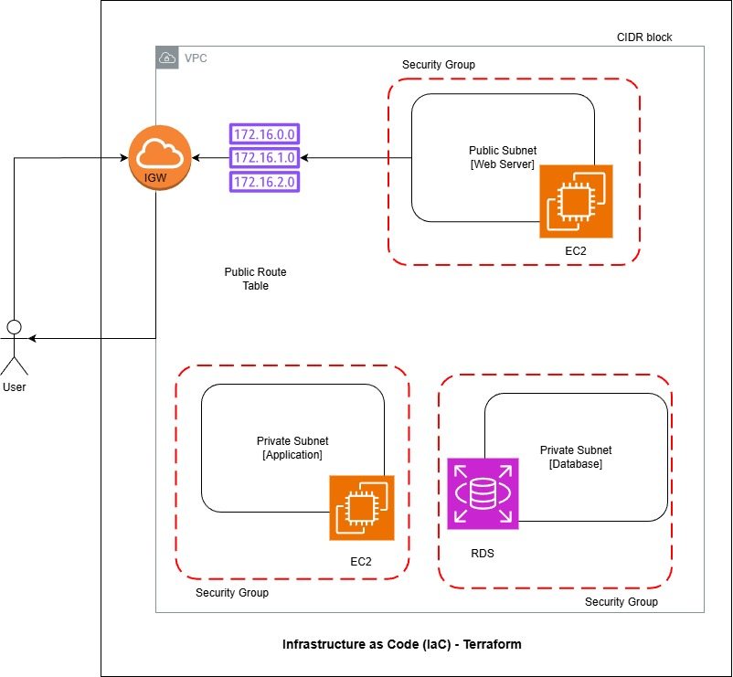

# 🌩️ Multi-Tier AWS Infrastructure using Terraform

This project demonstrates how to provision a **multi-tier AWS infrastructure using Terraform (Infrastructure as Code)**.
The setup automates cloud resource creation and follows AWS networking and security best practices.

---

## 🧭 Architecture

**User** → EC2 (Web/App Tier – Public Subnet) → Database (Private Subnet)

**VPC**: Isolated network for resources

**Public Subnet**: Hosts EC2 instance accessible from the internet

**Private Subnet**: Hosts database for secure backend storage

**Internet Gateway**: Enables internet access for public resources

**Route Tables**: Manage traffic routing

**Security Groups**: Control inbound and outbound traffic

## 📊 **Architecture Diagram**  


---

## ⚙️ Services Used

AWS EC2 | AWS VPC | Subnets | Route Tables | Internet Gateway | Security Groups | RDS / Self-Managed DB | Terraform

---

## Deployment Steps

Configure AWS credentials

```HCL
aws configure 
```


Initialize Terraform

```HCL
terraform init 
```

Validate Terraform configuration

```HCL
terraform validate 
```


Review infrastructure plan

```HCL
terraform plan
```


Apply Terraform configuration

```HCL
terraform apply
```
---

## ✅ Verification

✅ EC2 instance accessible via public IP

✅ Secure communication between application and database tiers

✅ Resources successfully created and verified in AWS Console

---

## 🧰 Tools & Technologies

AWS | Terraform | Linux | Git | GitHub

---

## ✨ Author

Gowri Suresh
🔗 [GitHub: Gowri0109](https://github.com/Gowri0109)  

🔗 [LinkedIn: linkedin.com/in/gowrisuresh01](https://linkedin.com/in/gowrisuresh01)


